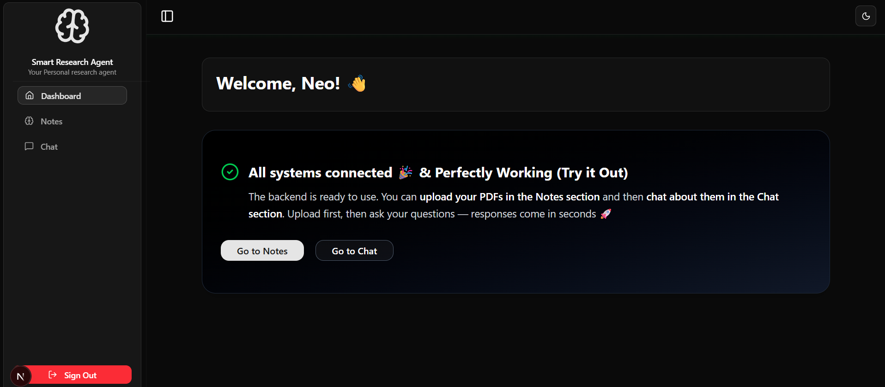

# 🚀 Smart Research Assistant  

## 📸 Screenshots

<p align="center">
  
</p>

<p align="center">
  
</p>

<p align="center">
  
</p>

<p align="center">
  
</p>

<p align="center">
  
</p>

<p align="center">
  
</p>


<p align="center">
  <a href="https://nextjs.org"></a>
  <a href="https://react.dev"></a>
  <a href="https://prisma.io"></a>
  <a href="https://upstash.com/vector"></a>
  <a href="https://tailwindcss.com"></a>
  <a href="https://sdk.vercel.ai"></a>
</p>

---

An **AI-first Next.js app** that lets users authenticate, upload PDFs, and chat with an assistant that references their own content.  
Built with **React 19, Next.js 15, Turbopack, Tailwind v4, Better Auth, Prisma, Upstash Vector, and AI SDK**.  

---

## ✨ Highlights
- ⚡ Modern App Router (Next.js 15) + React 19 + Turbopack  
- 🔐 Auth: Better Auth (Email/Password + Google OAuth)  
- 📚 Vector search via Upstash Vector (per-user namespaces)  
- 🤖 AI chat with streaming responses (`ai`, `@ai-sdk/openai`)  
- 📂 PDF/DOC/DOCX ingestion with LangChain loaders + chunking  
- 🎨 Polished UI: Tailwind v4 + Radix UI + Lucide  

---

## 🛠 Tech Stack
- **Frontend:** Next.js 15, React 19, TypeScript  
- **Styling:** Tailwind v4, Radix UI, Lucide Icons  
- **Auth:** Better Auth + Prisma ORM (PostgreSQL)  
- **Database:** Prisma + PostgreSQL  
- **AI/Vector:** AI SDK, LangChain, Upstash Vector  
- **State:** TanStack Query 5  

---

## 📂 Project Structure
```bash
src/
  app/                         # App Router pages & API routes
    api/
      auth/[...all]/route.ts   # Better Auth handler
      chat/route.ts            # Chat with RAG context
      document/route.ts        # Document ingestion
  components/                  # UI (chat, auth, dashboard)
  lib/                         # Auth, Vector, Prisma client configs
  actions/                     # Server actions
prisma/
  schema.prisma                # Data models


pnpm install   # install dependencies
npx prisma generate
npx prisma migrate dev --name init
pnpm dev       # start dev server
